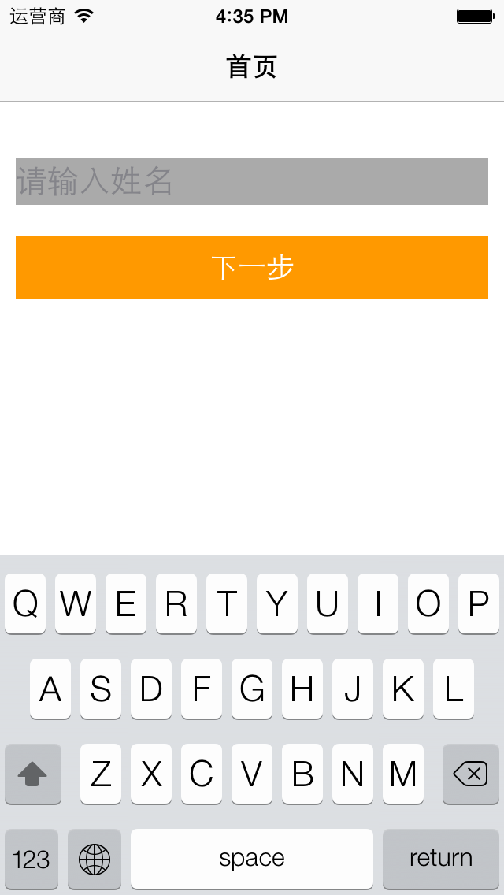
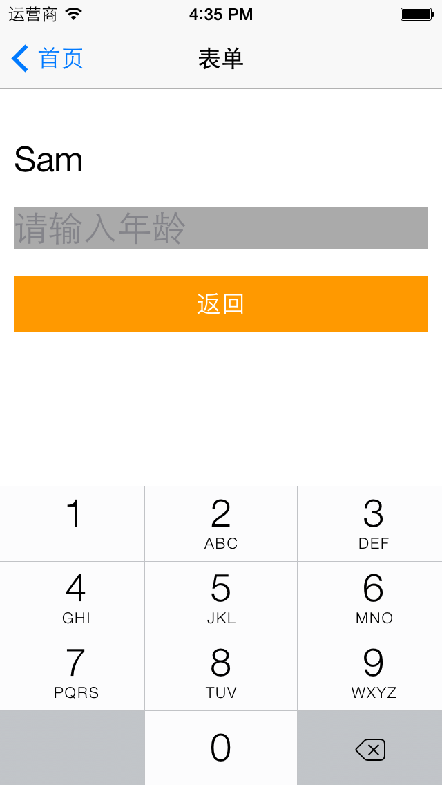

# 在ViewController间传递数据

## 功能
1 在HomeScreen输入名字，并将名字传到FormScreen
2 在FormScreen显示由HomeScreen传过来的名字，然后输入年龄，传回HomeScreen
3 弹出对话框，显示用户输入的年龄

## 依赖的Gem
``ProMotion``
``bubble-wrap``

## 安装方法
安装相关的Gem
``bundle install``
运行程序
``rake``

## 截图

